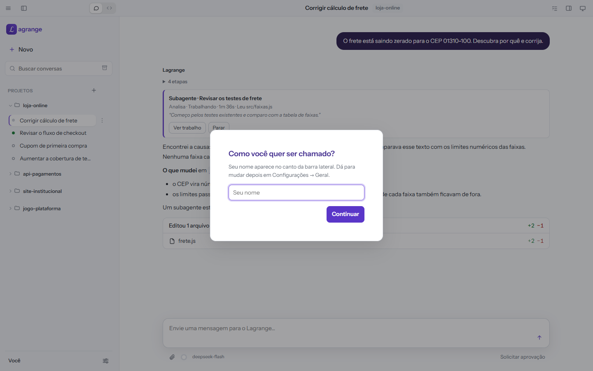
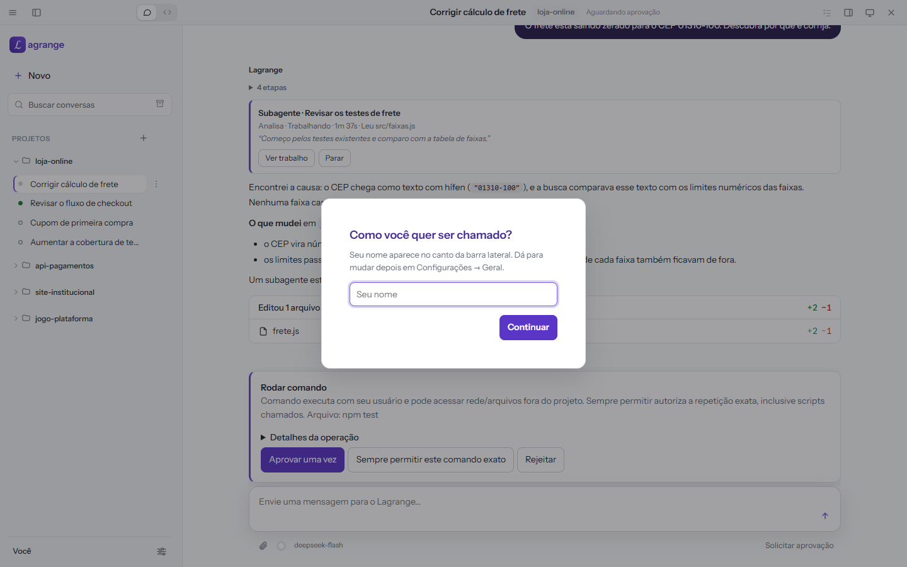
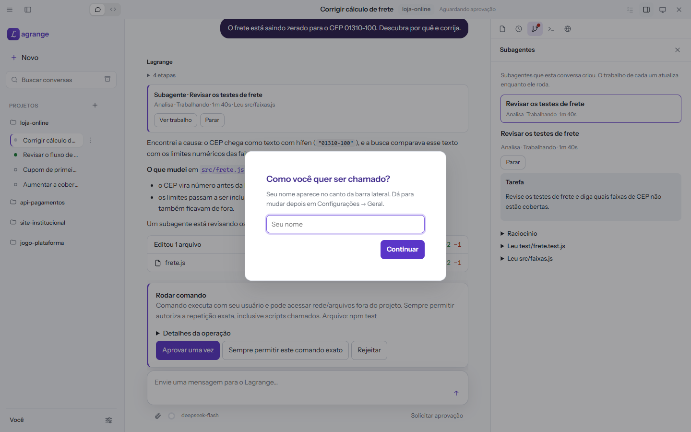
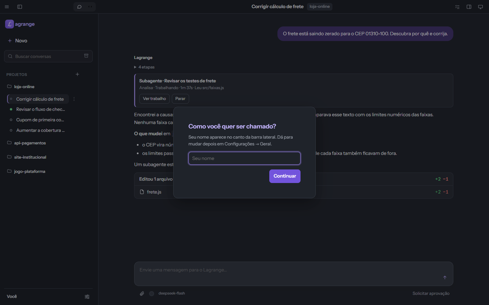

# ℒ Lagrange

**Imagine um assistente como o Claude Desktop ou o ChatGPT com o Codex, só que rodando com modelos abertos e baratos, como DeepSeek, Kimi, GLM e Qwen, e com você no controle de tudo o que ele faz.**

O Lagrange é um assistente de IA para Windows que trabalha nos seus projetos: lê e altera arquivos, roda comandos, divide tarefas entre subagentes e opera aplicativos como o navegador, o Blender e o Unity. Você usa pela janela do app, pelo terminal ou dentro do VS Code, e as três formas compartilham o mesmo projeto, as mesmas conversas e a mesma memória. O assistente roda na sua máquina; só o modelo, que você escolhe, fica na nuvem do provedor.

Este repositório guarda só o instalador e as versões publicadas. O código-fonte é privado.



| Nada com efeito acontece sem você aprovar | Subagentes trabalham em paralelo, e você acompanha cada um |
|---|---|
|  |  |

<details><summary>Tema escuro</summary>



</details>

As imagens são de um projeto de demonstração e são geradas a cada versão, a partir da própria interface publicada.

## O que ele faz hoje

- **Projetos de verdade.** Cada projeto (uma pasta, com ou sem Git) tem as suas conversas, memória, regras e consumo. Há também conversas pessoais, fora de qualquer projeto.
- **Subagentes.** Uma conversa pode entregar partes do trabalho a subagentes, que analisam ou editam em paralelo, cada um que edita na sua própria worktree. Você acompanha cada um e pode entrar na conversa de qualquer subagente.
- **Você decide o que ele pode fazer.** Três modos: **Solicitar aprovação** (o padrão: cada efeito vira um cartão para você aprovar), **Aprovar por mim** (ele age sozinho dentro do projeto) e **Acesso completo**. Aprovações "sempre" podem ser revistas e revogadas. A política é aplicada pelo código, não pelo prompt.
- **Shell confinado.** Os comandos rodam num sandbox do Windows (AppContainer), sem rede e sem acesso ao resto do seu perfil; liberar a internet é uma escolha sua, por projeto.
- **Nada de surpresa no código.** Cada conversa pode trabalhar numa worktree separada; você revisa o diff, integra quando quiser, desfaz a última resposta ou volta a qualquer mensagem.
- **Aplicativos.** O navegador (contido) e o Blender e o Unity, preparados pelo próprio app, com cada ação visual autorizada na sessão. Qualquer outro programa que tenha um servidor MCP (GitHub, bancos de dados, ferramentas de design…) ou linha de comando também pode ser usado, conectado por projeto.
- **Memória e skills.** O que ele aprende sobre o projeto vira memória que você confirma, exporta e importa; skills e servidores MCP estendem o que ele sabe fazer.
- **Automações agendadas**, com limite de duração e, quando o modelo tem custo, orçamento definido na criação.
- **Custo à vista.** Consumo de tokens e custo por conversa, por modelo e por projeto; um orçamento pode barrar a chamada antes de ela acontecer.
- **Modo plano, imagens e esforço de raciocínio** escolhidos por conversa; avisos na área de trabalho quando algo pede a sua atenção com o app em segundo plano.

## Por que "Lagrange"

A marca é o **ℒ**, o símbolo do **Lagrangiano**, que leva o nome do matemático **Joseph-Louis Lagrange**: uma única função que descreve um sistema inteiro e da qual saem todas as equações do movimento. É o que o projeto busca ser: um só núcleo do qual partem as várias formas de agir (app, terminal, VS Code, subagentes).

Dá para ler o nome também pelos **pontos de Lagrange**, lugares entre dois corpos grandes, como a Terra e o Sol, onde um objeto pequeno fica em equilíbrio, e onde ficam telescópios como o James Webb. É onde o Lagrange quer estar: em equilíbrio entre você e os modelos, sem cair para nenhum dos lados.

## Instalar

**[Baixe o LagrangeSetup.exe](https://github.com/rafa210587/lagrange/releases/latest/download/LagrangeSetup.exe)**, abra, escolha o que instalar e clique em **Instalar**.

Ou, no PowerShell (abre a mesma janela):

```powershell
irm https://raw.githubusercontent.com/rafa210587/lagrange/main/install.ps1 | iex
```

A instalação é **só para a sua conta** e **não pede administrador**. Leva poucos minutos e baixa cerca de 200 MB.

Enquanto o instalador não é assinado, o Windows pode mostrar "O Windows protegeu o computador": clique em **Mais informações → Executar assim mesmo**. O comando do PowerShell não passa por esse aviso.

### Escolher o que instalar

O instalador pergunta quais destas partes você quer; pode marcar uma, duas ou as três. O motor do assistente é instalado sempre, e as três usam o mesmo.

| Parte | Maturidade | O que é |
|---|---|---|
| **App do Lagrange** | Beta | A janela com as conversas por projeto, com atalho no Menu Iniciar. É a parte principal e a mais testada: aprovações, revisão de alterações, memória, worktrees, automações agendadas e os aplicativos (navegador, Blender, Unity) |
| **Terminal** | Beta | O comando `lagrange` em qualquer terminal: conversa em tela cheia, `exec` de um turno, sessões, modelo e memória do projeto. Recebe melhorias quase todo dia |
| **Extensão do VS Code** | Prévia | O painel **Lagrange** (ℒ) na barra lateral do VS Code, conversando sobre a pasta aberta com a seleção e o arquivo como contexto. Só aparece como opção se o VS Code estiver instalado |

**Beta**: completo e testado, ainda mudando. **Prévia**: funciona, com menos testes. Tudo está na versão 0.1.

Para instalar sem perguntas (por exemplo, num script), diga as partes antes do comando: `$env:LAGRANGE_COMPONENTS = 'app,terminal'` (qualquer combinação de `app`, `terminal` e `vscode`).

Para mudar a escolha depois, rode o instalador de novo e marque o que quiser.

## Como usar

### 1. Pegue uma chave de API

O Lagrange conversa com o modelo que você escolher, pela API do provedor. O padrão é o **DeepSeek**, o único validado em uso real até agora. Os outros provedores chineses abaixo aparecem no catálogo do app e devem funcionar igual, mas ainda não foram testados por nós.

| Provedor | Modelos (exemplos) | Onde criar a chave | Nome no app |
|---|---|---|---|
| **DeepSeek** (padrão, validado) | `deepseek-flash`, `deepseek-v4-pro` | [platform.deepseek.com](https://platform.deepseek.com/api_keys) | `deepseek` |
| Moonshot (Kimi) | `kimi-k3`, `kimi-k2.7-code` | [platform.moonshot.ai](https://platform.moonshot.ai) | `moonshotai` (ou `moonshotai-cn` para a conta da China) |
| Zhipu / Z.AI (GLM) | `glm-5`, `glm-5.3-flash` | [open.bigmodel.cn](https://open.bigmodel.cn) ou [z.ai](https://z.ai) | `zhipuai` ou `zai` |
| Alibaba (Qwen) | `qwen3.7-max`, `qwen-flash` | [Alibaba Cloud Model Studio](https://www.alibabacloud.com/product/modelstudio) | `alibaba` (ou `alibaba-cn`) |
| MiniMax | `MiniMax-M3` | [minimax.io](https://www.minimax.io) | `minimax` |
| SiliconFlow (vários modelos abertos) | Qwen, DeepSeek, Hunyuan e outros | [siliconflow.com](https://www.siliconflow.com) | `siliconflow` |

Qualquer outro provedor com API compatível com a da OpenAI também serve: no app, escolha **OpenAI compatível** e informe a URL e a chave.

**Seus dados:** o que você escreve e o que o assistente lê dos seus arquivos para responder vão para os servidores do provedor escolhido. Escolha o provedor de acordo com o que você pode compartilhar.

### 2. Configure no app

1. Abra o **Lagrange** pelo Menu Iniciar e clique em **Adicionar projeto** (uma pasta sua, ou um projeto novo guardado pelo app).
2. Vá em **Configurações → Modelos**.
3. Procure o provedor pelo nome (por exemplo, `deepseek`), cole a chave e escolha se ela vale para **a conta toda** (todos os projetos) ou **só este projeto**.
4. Marque os modelos que quer usar e clique em **Testar modelos habilitados**; cada um deve responder.
5. Salve. No chat, escolha o modelo embaixo da caixa de mensagem e converse.

A chave fica guardada com a proteção de dados do Windows (DPAPI), só para a sua conta; ela não vai para os arquivos do projeto.

### 3. No terminal

Com a chave configurada no app, na pasta de um projeto:

```powershell
lagrange                                  # conversa em tela cheia (-c continua a última)
lagrange exec "resuma o README"           # uma pergunta e a resposta, sem tela cheia
lagrange model deepseek/deepseek-flash    # o modelo deste projeto (provedor/modelo)
lagrange doctor                           # confere instalação, projeto e modelo
```

Digite `/` dentro da conversa para ver os comandos (`/modelo`, `/plano`, `/revisar`, `/desfazer`…). `lagrange --help` lista o resto.

### 4. No VS Code

Abra uma pasta confiável e clique no ícone **ℒ** na barra lateral (ou **Ctrl+Alt+L**). O painel conversa sobre essa pasta; use o chip do arquivo aberto e da seleção para dar contexto. A extensão usa o modelo e a chave configurados no app.

## Requisitos

- Windows 11, 64 bits (x64). O Windows 10 deve funcionar, mas ainda não foi validado.
- **Disco:** cerca de 700 MB (uns 450 MB se você já tiver o PowerShell 7); cada atualização guarda mais uns 60 MB, porque a versão anterior fica ao lado.
- **Memória:** cada projeto aberto usa cerca de 1 GB. No máximo três ficam ligados ao mesmo tempo: ao abrir um quarto, o que você usou há mais tempo é suspenso (a não ser que esteja trabalhando) e volta sozinho quando você retorna a ele; um projeto parado por 30 minutos também é suspenso. Recomendado: 16 GB de RAM.
- **Idioma:** a interface é em português.
- Internet durante a instalação e para conversar com o modelo.
- Uma chave de API de um provedor de modelo (veja [Como usar](#como-usar)).
- Opcionais: **Git**, para projetos com worktree por conversa; **VS Code**, para a extensão; **Blender** e **Unity**, para operar esses aplicativos.

## O que o instalador faz

1. Baixa, para `%LOCALAPPDATA%\HarnessAI\runtime`, versões fixas de **Node.js**, **uv** e, se não houver um no sistema, **PowerShell 7**. Cada arquivo é conferido pelo SHA-256 antes de ser usado. Nada é instalado no sistema como um todo.
2. Instala o **Python 3.12** pelo uv, também só para a sua conta.
3. Baixa a última versão do Lagrange desta página de Releases e confere o SHA-256 publicado.
4. Instala o **Microsoft Edge WebView2 Runtime** se ele faltar (já vem no Windows 11).
5. Conforme a sua escolha: cria o atalho no Menu Iniciar, põe o comando `lagrange` no PATH da sua conta e instala a extensão no VS Code. O pacote da extensão fica também em `%LOCALAPPDATA%\HarnessAI\bin\lagrange.vsix`.

A instalação só baixa arquivos; nenhum dado seu é enviado. Se algo falhar, o registro completo fica em `%TEMP%\lagrange-setup.log`.

## Atualizar

Rode o instalador de novo. A versão nova fica ao lado da anterior; projetos, conversas, chaves e configurações são mantidos. Se uma conversa estiver respondendo, a versão anterior só fecha quando ela terminar.

## Desinstalar

Ainda não há desinstalador. Para remover tudo:

1. Feche o Lagrange.
2. Apague a pasta `%LOCALAPPDATA%\HarnessAI` (isso apaga também conversas, chaves e configurações).
3. Apague o atalho **Lagrange** no Menu Iniciar.
4. Em **Configurações → Sistema → Sobre → Configurações avançadas do sistema → Variáveis de ambiente**, remova da variável **Path** do usuário as entradas que apontam para `%LOCALAPPDATA%\HarnessAI`.
5. Se instalou a extensão: no VS Code, **Extensões → Lagrange → Desinstalar**.

## Onde já foi validado

| Ambiente | O que foi validado |
|---|---|
| Windows 11 Pro 25H2 (build 26200), x64, escala de tela 100% e 150% | Instalação pelo `LagrangeSetup.exe` numa pasta isolada, simulando uma máquina sem Node.js, uv e PowerShell 7 (baixados pelo instalador, sem administrador); a escolha das partes chega ao instalador; o app instalado abre, reabre depois de ser encerrado à força e recupera seleção, rascunho e histórico. Os testes isolados não criam o atalho, não mexem no PATH nem no VS Code |
| Windows 11 Pro 25H2 (build 26200), x64 | O pacote da extensão instala no VS Code (num perfil isolado); os testes automáticos do app, do terminal e da extensão rodam a cada versão, antes da publicação |
| Windows 11 Pro 25H2 (build 26200), x64, com DeepSeek | Uso real do app com o DeepSeek, incluindo operar Blender 4.5 e Unity 6000.5 |
| Windows (GitHub Actions `windows-latest`) | Suíte de aceitação do app em versões anteriores ao pacote público |
| Linux (GitHub Actions `ubuntu-latest`) | Testes do núcleo e da política de segurança (o app em si é só para Windows) |

**Ainda não validado:** o atalho, o PATH e a extensão criados por uma instalação real a partir do instalador público; a instalação pelo comando do PowerShell (`install.ps1`), que baixa e roda o mesmo `LagrangeSetup.exe`; os provedores além do DeepSeek; Windows 10; Windows em ARM (não suportado); uma instalação limpa do Windows, sem nada pré-instalado; uma conta sem permissão de administrador; redes com proxy.

Encontrou um problema? Abra uma [issue](https://github.com/rafa210587/lagrange/issues) com o arquivo `%TEMP%\lagrange-setup.log`.

## Privacidade

O Lagrange não tem telemetria: não envia uso, erros nem estatísticas para ninguém. Conversas, memória, chaves e configurações ficam em `%LOCALAPPDATA%\HarnessAI`, na sua máquina. O que sai dela é o que precisa sair: o que você escreve e o que o assistente lê para responder, para o provedor do modelo que você escolheu; e, quando você usa, o navegador e os servidores MCP que você conectou.

## Limitações conhecidas

- Só Windows x64 (validado no Windows 11); não há versão para macOS nem Linux.
- O controle visual (ver a tela, clicar, digitar) vale só para o navegador, o Blender e o Unity preparados pelo app.
- Entre os provedores, só o DeepSeek foi validado em uso real.
- O instalador ainda não é assinado, e não há desinstalador.
- Cada projeto aberto mantém o seu próprio motor na memória.

## Licença

[PolyForm Noncommercial 1.0.0](LICENSE). Em palavras simples: **é grátis para uso pessoal, estudo, pesquisa e organizações sem fins lucrativos**; você pode usar e distribuir cópias sem alteração. **Uso comercial** (numa empresa, para atender clientes, dentro de um produto pago) **exige licença separada**: rafael210587@gmail.com. O texto da licença é o que vale.

"Lagrange" e o símbolo ℒ são marcas de Rafael Meira Gonçalves. Claude, ChatGPT, Codex, VS Code e os nomes dos provedores de modelo são marcas dos seus respectivos donos; são citados só para comparação e compatibilidade, e o Lagrange não tem relação com nenhum deles.
